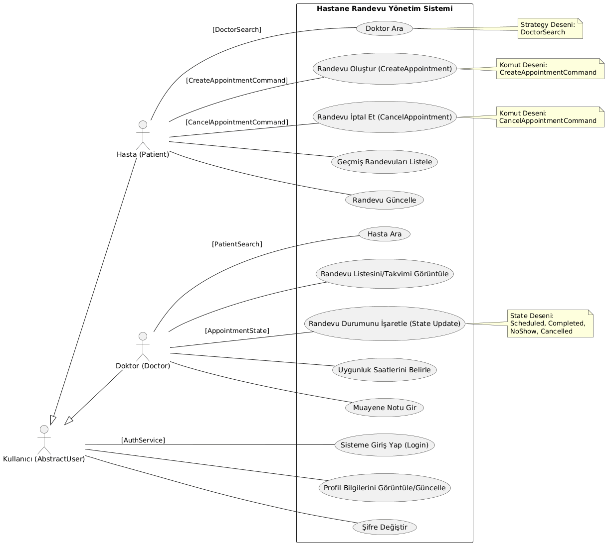
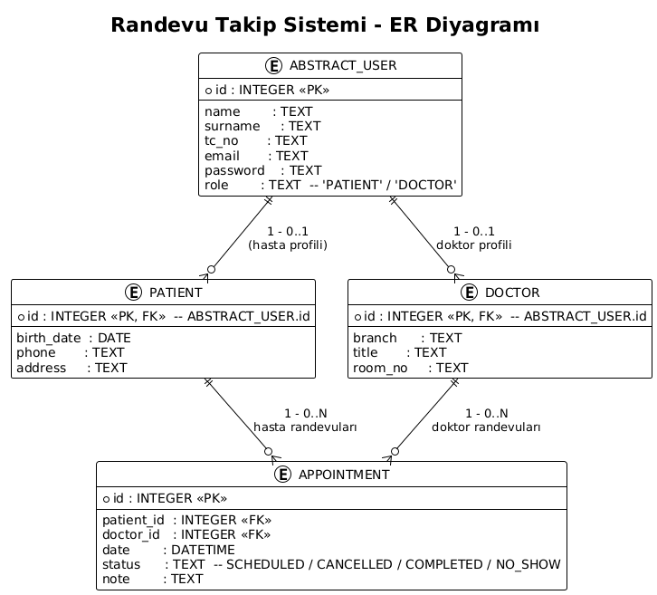
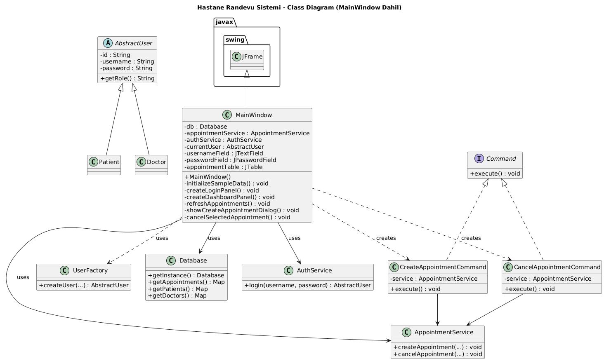
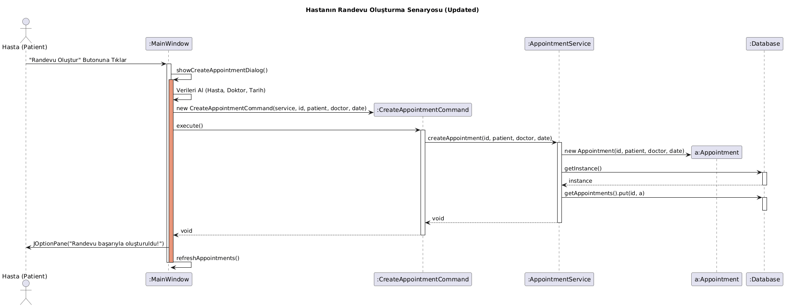

## Randevu Takip Sistemi

### İçindekiler
- **Proje Hakkında**
- **Temel Özellikler**
- **Kullanılan Teknolojiler**
- **Yazılım Mimarisi ve Tasarım Desenleri**
- **UML Diyagramları**
- **Dosya Yapısı**
- **Kurulum**
- **Çalıştırma**
- **Geliştirme ve Katkı**

---

## Proje Ekibi

Aşağıda projeyi gerçekleştiren ekip üyelerinin bilgileri ve GitHub profilleri yer almaktadır:

| Ad Soyad | Öğrenci No | Görev | GitHub Linki |
|----------|------------|-------|----------------|
| Yusuf Aksu | 1220505063 | Backend & Patterns | https://github.com/yusufaksuu21/Java-Donem-Projesi |
| Mehmed El Ahmed | 5210505104 | GUI & Frontend | https://github.com/jihaad-an |
| Hasan Talha Uslu | 1210505802 | Database & Diagrams | https://github.com/HasantUslu/Java-Donem-Projesi |

---


## Proje Hakkında

Bu sistem, **Java** programlama dili ve **Swing** kütüphanesi kullanılarak geliştirilmiş bir **Randevu Takip Sistemi**dir.  
Projenin temel amacı, nesne yönelimli programlama (OOP) prensiplerine sadık kalarak, **sürdürülebilir**, **genişletilebilir** ve **bakımı kolay** bir yazılım mimarisi ortaya koymaktır.

Uygulama; doktorlar ve hastalar için randevu oluşturma, yönetme ve takip etme süreçlerini tek bir merkezden yönetmeyi hedefler.

### Temel Özellikler

- **Kullanıcı Girişi**
  - Hasta ve Doktorlar için özelleştirilmiş giriş ekranları.
  - Kimlik doğrulama işlemleri `AuthService` üzerinden yönetilir.

- **Randevu İşlemleri (CRUD)**
  - Randevu oluşturma, listeleme, güncelleme ve iptal etme.
  - Randevular `Appointment` modeli ve `AppointmentService` servisi üzerinden yönetilir.

- **Arama Modülü**
  - Doktor ve hasta bilgilerini filtreleyerek arama yapma.
  - Arama stratejileri `SearchStrategy`, `DoctorSearch` ve `PatientSearch` sınıfları ile kurgulanmıştır.

- **Bildirim Sistemi**
  - Randevu durum değişikliklerinde (oluşturma, iptal vb.) ilgili kullanıcılara bildirim gönderilmesi.
  - Bildirim akışı `Observer` arayüzü ve `NotificationService` üzerinden yürütülür.

- **GUI (Swing) Arayüzü**
  - Kullanıcı dostu, masaüstü tabanlı arayüz.
  - Ana pencere ve kayıt ekranları `MainWindow`, `DoctorRegistrationDialog`, `PatientRegistrationDialog` sınıfları ile tasarlanmıştır.

---

## Kullanılan Teknolojiler

- **Programlama Dili**: Java (JDK 11+ önerilir, JDK 17 uyumludur)
- **Kullanıcı Arayüzü**: Java Swing
- **Veritabanı**: SQLite (`app.db`, `init_schema.sql`)
- **Mimari Yaklaşım**: Katmanlı mimari (UI, Service, Model, Data Access)
- **Tasarım Desenleri**: Singleton, Factory, Abstract Factory, Observer, State, Command, Strategy

---

## Yazılım Mimarisi ve Tasarım Desenleri

Projede **SOLID** prensipleri gözetilmiş ve aşağıdaki tasarım desenleri aktif olarak kullanılmıştır:

1. **Singleton Pattern**
   - Veritabanı bağlantısı `Database` sınıfı ile tekil (singleton) bir örnek üzerinden yönetilir.
   - Böylece uygulama genelinde aynı veritabanı bağlantısı yeniden kullanılabilir.

2. **Factory Method Pattern**
   - `UserFactory` sınıfı ile `Patient` (Hasta) ve `Doctor` (Doktor) nesnelerinin üretimi soyutlanmıştır.
   - Kullanıcı türüne göre uygun nesne üretimi merkezileştirilmiştir.

3. **Abstract Factory Pattern**
   - Kullanıcı üretimi için `AbstractFactory` yapısı tanımlanmış, böylece farklı kullanıcı tipleri için genişletilebilir bir nesne üretim altyapısı sağlanmıştır.

4. **Observer Pattern**
   - Randevu durumu değiştiğinde (örneğin iptal, oluşturma, tamamlama), `NotificationService` aracılığıyla ilgili kullanıcılara (`AbstractUser` türevleri) otomatik bildirim gönderilir.
   - Değişikliklerden haberdar olması gereken nesneler, gözlemci (observer) olarak sisteme kayıt olur.

5. **State Pattern**
   - Randevu durumları (`ScheduledState`, `CancelledState`, `CompletedState`, `NoShowState`) birer sınıf olarak tasarlanmıştır.
   - Durum geçişleri, `AppointmentState` arayüzü üzerinden yönetilir.
   - Böylece randevu nesnesi, içsel durumuna göre farklı davranış sergileyebilir.

6. **Command Pattern**
   - Randevu oluşturma (`CreateAppointmentCommand`) ve iptal etme (`CancelAppointmentCommand`) işlemleri komut nesneleri olarak kapsüllenmiştir.
   - Komutların tek bir arabirim (`Command`) üzerinden yönetilmesi, geri alma (undo) gibi işlemlerin eklenmesini kolaylaştırır.

7. **Strategy Pattern**
   - Arama işlemleri için `SearchStrategy` arayüzü tanımlanmış ve
     - `DoctorSearch`
     - `PatientSearch`
     stratejileri ile farklı arama mantıkları uygulanabilir hale getirilmiştir.
   - Böylece arama algoritmaları, çalışma zamanında dinamik olarak değiştirilebilir.

---

## UML Diyagramları

Projenin mimari yapısını ve işleyişini gösteren teknik diyagramlar aşağıdadır (README ile aynı dizinde varsayılmaktadır):

### 1. Use-Case Diyagramı

Sistemdeki aktörlerin (Hasta, Doktor, Kullanıcı/Yönetici) yeteneklerini ve sistemle etkileşimlerini gösterir.  
Ayrıca **Command**, **Strategy** ve **State** desenlerinin devreye girdiği senaryolar belirtilmiştir.



### 2. Entity-Relationship (ER) Diyagramı

Veritabanı şemasını, `AbstractUser` kalıtım yapısını ve `Appointment` tablosunun ilişkilerini gösterir.  
Hasta ve Doktor kayıtlarının randevular ile ilişkisi bu diyagramda detaylandırılmıştır.



### 3. Class Diyagramı (Abstract Classes)

`AbstractUser`, `AbstractFactory`, `AppointmentState`, `Observer` gibi soyut sınıf ve arayüzlerin sınıf hiyerarşisindeki yerini gösterir.  
Ayrıca, `Doctor`, `Patient`, `Appointment` gibi somut sınıflar arasındaki ilişkiler de bu diyagramda mevcuttur.



### 4. Sequence (Sıralama) Diyagramı

Bir hastanın randevu oluşturma senaryosunu (`CreateAppointment`) adım adım göstermektedir.  
GUI katmanı, Command nesneleri, Service katmanı ve Database katmanı arasındaki mesaj trafiği bu diyagramda ayrıntılı olarak açıklanır.



---

## Dosya Yapısı

Proje kök dizini: **`JAVAPROJEODEV`**

- **`src/command`**  
  - **İçerik**: Komut (Command) desenine ait sınıflar.  
  - Örnekler: `Command`, `CreateAppointmentCommand`, `CancelAppointmentCommand`.

- **`src/factory`**  
  - **İçerik**: Nesne üretim fabrikaları ve soyut fabrika yapıları.  
  - Örnekler: `AbstractFactory`, `UserFactory`.

- **`src/models`**  
  - **İçerik**: Temel veri modelleri ve randevu durumları (State pattern).  
  - Örnekler: `AbstractUser`, `Doctor`, `Patient`, `Appointment`,  
    `states/AppointmentState`, `states/ScheduledState`, `states/CancelledState`, `states/CompletedState`, `states/NoShowState`.

- **`src/observer`**  
  - **İçerik**: Gözlemci (Observer) deseni arayüzleri.  
  - Örnekler: `Observer`.

- **`src/search`**  
  - **İçerik**: Strateji (Strategy) desenine ait arama sınıfları.  
  - Örnekler: `SearchStrategy`, `DoctorSearch`, `PatientSearch`.

- **`src/services`**  
  - **İçerik**: İş mantığı servisleri ve veritabanı işlemleri.  
  - Örnekler:  
    - `AppointmentService`, `AuthService`, `NotificationService`  
    - `Database`, `DatabaseService`

- **`src/ui`**  
  - **İçerik**: Swing arayüz kodları (GUI).  
  - Örnekler: `MainWindow`, `DoctorRegistrationDialog`, `PatientRegistrationDialog`.

- **`src/utils`**  
  - **İçerik**: Yardımcı sınıflar ve veritabanı başlangıç işlemleri.  
  - Örnekler: `DbInit`, `DbQuery`, `TestLogin`.

- **Diğer Dosyalar**
  - `app.db` : SQLite veritabanı dosyası.
  - `app.db.sql` / `init_schema.sql` : Veritabanı şemasını oluşturan SQL scriptleri.
  - `RunApp.java` : Uygulamanın ana giriş noktası (main metodu).

---

## Kurulum

1. **Gereksinimler**
   - **Java JDK 11+** (önerilen: JDK 17)
   - Bir Java IDE’si (önerilen: **IntelliJ IDEA** veya **Eclipse**)
   - (İsteğe bağlı) Git kurulumu

2. **Projeyi İndirme**
   - Bu projeyi `.zip` olarak indirip aşağıdaki konuma çıkarın:
     - `C:\Users\Monster\Desktop\Java-Donem-Projesi-main`
   - Proje kök klasörü:
     - `Java-Donem-Projesi-main/JAVAPROJEODEV`
   - Alternatif olarak Git ile:
     ```bash
     git clone <repo-adresi>
     ```

3. **IDE ile Açma**
   - IDE’nizde **`JAVAPROJEODEV`** klasörünü proje olarak açın.
   - `src` klasörünün **Source Root** olarak ayarlı olduğundan emin olun.
   - Veritabanı dosyası (`app.db`) ve şema dosyası (`init_schema.sql`) proje kökünde hazırdır. Gerekirse şemayı `init_schema.sql` üzerinden inceleyebilirsiniz.

---

## Çalıştırma

1. **IDE Üzerinden Çalıştırma (Önerilen)**
   - `src` klasörü içindeki `RunApp.java` dosyasını açın.
   - Dosyada bulunan `main` metodunu **Run**/Play tuşu ile çalıştırın.
   - Uygulamanın ana penceresi (`MainWindow`) açıldığında, hasta/doktor giriş ekranları üzerinden sisteme erişebilirsiniz.

2. **Komut Satırından Çalıştırma (İsteğe Bağlı)**
   - `JAVAPROJEODEV` klasöründe bir terminal / PowerShell açın.
   - Tüm `.java` dosyalarını derleyin:
     ```bash
     javac -d out src/**/*.java
     ```
   - Ardından uygulamayı çalıştırın:
     ```bash
     java -cp out RunApp
     ```
   - GUI arayüzü açılarak randevu yönetim ekranlarına erişebilirsiniz.

---

## Geliştirme ve Katkı

- **Kod Stili**
  - Nesne yönelimli prensiplere (SOLID) ve mevcut tasarım desenlerine uygun geliştirme yapılması beklenir.
  - Yeni özellik eklerken mümkün olduğunca mevcut desenleri (Command, Strategy, State, Observer) genişletmeniz önerilir.

- **Yeni Özellik Önerileri**
  - Raporlama ekranları (günlük/haftalık randevu raporları)
  - Rol tabanlı yetkilendirme (örneğin yönetici paneli)
  - E-posta / SMS entegrasyonu ile gerçek bildirim gönderimi

- **Katkıda Bulunma**
  - Yeni bir özellik eklemeden önce ilgili sınıf diyagramını ve mimariyi gözden geçirin.
  - Açtığınız pull request’lerde:
    - Yaptığınız değişiklikleri kısaca açıklayan bir özet
    - Gerekliyse güncellenmiş UML diyagramı veya ekran görüntüsü ekleyin.


